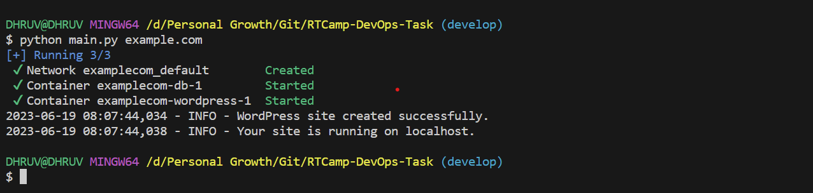
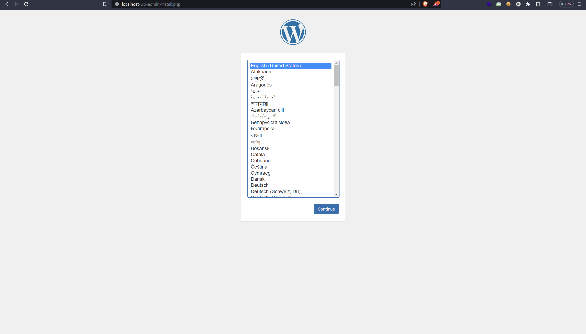
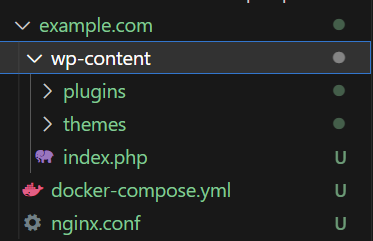
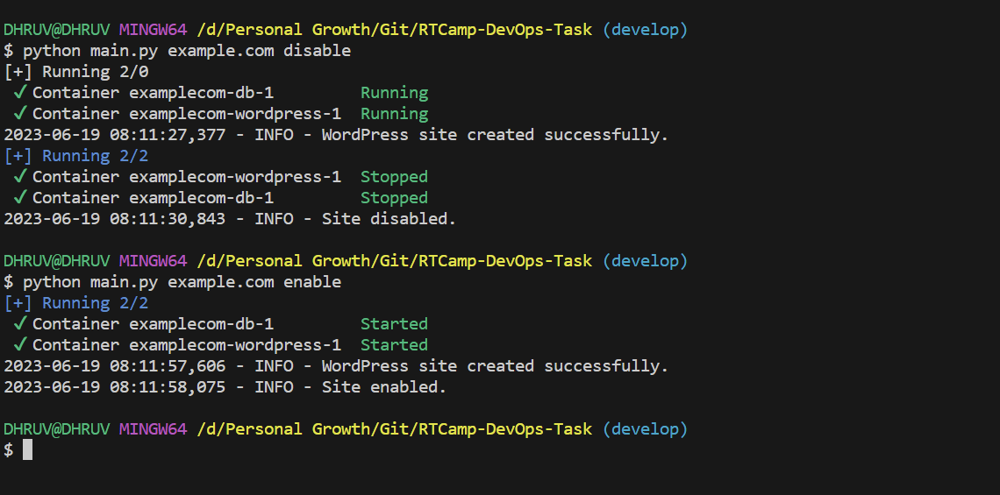
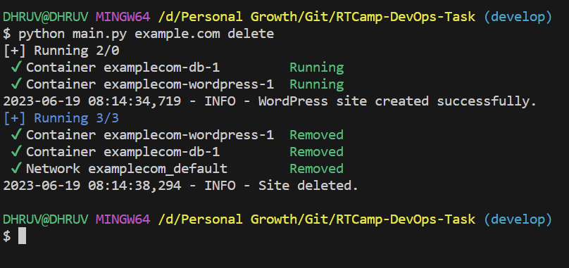

# RTCamp-DevOps-Task
- DevOps Engineer Interview task from RTCamp
- This module is designed to manage WordPress sites using Docker and Docker Compose. It automates the process of creating a new WordPress site, managing its enable/disable state, and deleting a site.

## Features

- Supports Multiple OS: Ubuntu, RHEL, CenOS, Windows, MacOS 
- Automatically Installation of `Docker` and `Docker-Compose`
- Automatically creation of `docker-compose.yml` and `nginx.conf`
- Automatically Register the website in `/etc/hosts` for Unix distribution and `C:\Windows\System32\drivers\etc\hosts` for Windows
- Available Command Line Utility

## Setting Up

- This module is built upon python version of 3.11.3
- Create `venv` using below command.
    ```
    python -m venv venv
    ```
- Activate the Virtual Environment

    For Windows:
    ```
    venv\Scripts\activate
    ```

    For macOS/Linux:
    ```
    source venv/bin/activate
    ```
- Install Dependencies
    ```
    pip install -r requirements.txt
    ```

## Usage
- To create the wordpress site execute the below command
    ```
    python3 main.py <site_name>
    ```
    Example:
    ```
    python3 main.py example.com
    ```
- It supports one of the following actions 
    ```
    python3 main.py <site_name> <action>
    ```
    `enable`: Enable the site.

    `disable`: Disable the site.
    
    `delete`: Delete the site.

## ScreenShots

- Create wordpress site.

    

- After creating the site, If you go to localhost, you will get below page. It may take 3 to 4 seconds after creation of container, or may me more depending on your hardware.

    

- If you see in folder structure, you can find nginx.conf and docker compose file along with wordpress site content.

    

- Enable or Disable wordpress site.

    

- Delete Site.

    
